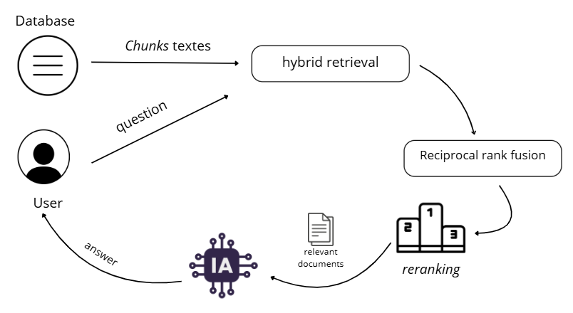
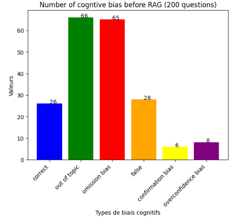
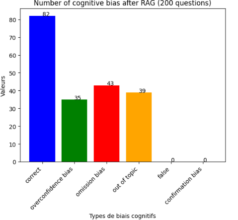

# Analysing and mitigating cognitive bias in answers generated by BioGPT

## Overview

This project implements a **Retrieval-Augmented Generation (RAG)** system to enhance BioGPT's ability to answer medical questions. The system combines traditional information retrieval techniques with question-answering models to provide accurate, contextually relevant medical information.

## 📖 Definitions of cognitive bias
- Omission bias occurs when relevant information in a given situation is neglected or ignored.
- Overconfidence bias, on the other hand, refers to an overestimation of the accuracy of one’s own knowledge or judgments.
- Confirmation bias refers to the tendency to search for, interpret or remember information in a way that confirms one’s initial beliefs or hypotheses.
  
## 🚀 Key Features
- **Merging 4 medical QA datasets**: PubMedQA,MedQuad,MedicationQA,MedQA-USMLE
- **RAG Architecture**: Combines retrieval and generation for improved medical QA
- **BioGPT Integration**: Uses the "microsoft/biogpt-large" model fine-tuned on medical data
- **Hybrid Retrieval**: combination of a sparse and dense retriever and fusion with RRF to benefit from lexical precision and semantic relevance
- **Intelligent Chunking**: Smart text segmentation for optimal context processing
- **Comprehensive Medical Coverage**: Handles 100+ diverse medical questions


## 🏗️ Architecture



## 📊Results
  
## 📋 Prerequisites

- Python 3.7+
- Medical QA dataset in CSV format

### Required Packages

- sentence-transformers 
- torch 
- pandas  
- sacremoses
- faiss-cpu
- rank-bm25
- scikit-learn
- langchain
  
## 🗄️ Data Format

The system expects a CSV file with the following structure:

```csv
question,answer,source,focus_area
"What are the symptoms of breast cancer?", "Breast cancer symptoms include...", "Medical Journal", "Oncology"
```

**Required columns:**
- `answer`: Medical knowledge content (used as retrieval context)
- `source`: Source of the medical information
- `focus_area`: Medical specialty or category

## ⚙️ Configuration

### Key Parameters

```python
# Retrieval settings
TOP_K_CONTEXTS = 10        # Number of contexts to retrieve per question
CHUNK_WORDS = 500          # Maximum characters per text chunk
CHUNK_OVERLAP = 50         # Overlap between chunks

# Model settings
MODEL_NAME = "microsoft/biogpt-large"
DEVICE = 0 if torch.cuda.is_available() else -1
```

### File Paths

```python
train_file = "path/to/your/medical_QA_dataset.csv"
OUT_JSON = "path/to/output/predictions.json"
OUT_CSV = "path/to/output/predictions.csv"
```

## 🚀 Usage

### Basic Usage

1. **Prepare your medical dataset** in the required CSV format
2. **Update file paths** in the configuration section
3. **Run the notebook** or script

### Custom Questions

Add your medical questions to the `query` list:

```python
query = [
    "What are the symptoms of diabetes?",
    "How to treat hypertension?",
    "What causes migraines?",
    # Add more questions...
]
```

## 📊 Output Format

### JSON Output

```json
{
  "question": "What are the symptoms of breast cancer?",
  "pred_answer": "Common symptoms include...",
  "source": "Medical Journal",
}
```

### CSV Output

Flat table format with all predictions and metadata for easy analysis.

## 🔧 Technical Details

### Retrieval Process

1. **Sparse Vectorization**: Creates document-term matrices 
2. **Dense Vectorization**: Creates dense vector that captures the semantic similarity
3. **Euclidean distance**: Ranks contexts by relevance to the question
4. **Reciprocal Rank Fusion**:Documents lists from the two retrievers are merged using the Reciprocal Rank Fusion (RRF) method.This method assigns a score to each document based on its position in each list 
5. **Top-3 Selection with Reranking**: Retrieves top-3 most relevant contexts for detailed processing

## 🏥 Medical Applications

### Use Cases

- **Clinical Decision Support**: Assist healthcare providers with medical queries
- **Patient Education**: Provide accurate medical information to patients
- **Medical Research**: Support literature review and knowledge discovery
- **Healthcare Training**: Educational tool for medical students and professionals

### Medical Domains Covered

- **General Medicine**: Common symptoms and treatments
- **Specialized Care**: Oncology, cardiology, neurology, etc.
- **Emergency Medicine**: Acute conditions and urgent care
- **Preventive Care**: Screening, vaccination, lifestyle advice

## 🔬 Research Contributions

This project demonstrates:

1. **RAG Effectiveness**: How retrieval augmentation improves medical QA accuracy
2. **Domain Adaptation**: BioGPT optimization for medical applications
3. **Context Optimization**: Intelligent text chunking for medical knowledge
4. **Scalable Architecture**: Framework for large-scale medical QA systems

## 📚 References

-  Luo, R., Sun, L., Xia, Y., Qin, T., Zhang, S., Poon, H., & Liu, T.-Y. (2022). BioGPT : Generative pre-trained transformer for biomedical text generation and mining. Briefings in Bioinformatics, 23(6), 1–11. https://doi.org/10.1093/bib/bbac409
- HUYEN, CHIP. AI Engineering: Building Applications with Foundation Models. O’REILLY MEDIA, 2025.
- Johnson, J., Douze, M., Jégou, H. Billion-scale similarity search with GPUs. IEEE Transactions on Big Data, 7(3), 535–547 (2019). https://doi.org/10.1109/TBDATA.2019.2921572
-  Ben Abacha, A., Demner-Fushman, D. A question-entailment approach to question answering. BMC Bioinformatics 20, 511 (2019). https://doi.org/10.1186/s12859-019-3119-4 
-  Jin, D., Pan, E., Oufattole, N., Weng, W.-H., Fang, H., & Szolovits, P. (2020). What disease does this patient have? A large-scale open domain question answering dataset from medical exams. In: Multidisciplinary Digital Publishing Institute.
-  Jin, Q., Dhingra, B., Liu, Z., Cohen, W., & Lu, X. (2019, November). PubMedQA: A dataset for biomedical research question answering. In Proceedings of the 2019 Conference on Empirical Methods in Natural Language Processing and the 9th International Joint Conference on Natural Language Processing (EMNLP-IJCNLP) (pp. 2567–2577). Association for Computational Linguistics. https://aclanthology.org/D19-1259/ 
- Ben Abacha, A., Mrabet, Y., Sharp, M., Goodwin, T., Shooshan, S. E., & Demner-Fushman, D. (2019, August). Bridging the gap between consumers’ medication questions and trusted answers. In Proceedings of the 17th World Congress on Medical and Health Informatics (MEDINFO 2019). International Medical Informatics Association. https://ebooks.iospress.nl/doi/10.3233/SHTI190176 

## 🤝 Contributing

Contributions are welcome! Areas for improvement:

- **Additional Medical Models**: Integration with other medical AI models
- **Enhanced Retrieval**: Advanced semantic search algorithms
- **Evaluation Metrics**: Medical QA-specific performance measures
- **Multi-language Support**: International medical knowledge bases

## 📄 License

This project is for research and educational purposes. Please ensure compliance with medical data privacy regulations (HIPAA, GDPR, etc.) when using with real patient data.

## ⚠️ Disclaimer

**This system is for research and educational purposes only. It should not be used for clinical decision-making or medical advice. Always consult qualified healthcare professionals for medical concerns.**

---

**Built with ❤️ for advancing medical AI research**


